# 📘 Navish — Technical Documentation

**Version:** 1.0.0
**Last updated:** 2026-07-28
**Audience:** Engineering team (frontend, backend, DevOps, new hires)

---

## Table of Contents

1. [Project Overview](#1-project-overview)
2. [Technology Stack](#2-technology-stack)
3. [Folder Structure](#3-folder-structure)
4. [Architecture](#4-architecture)
5. [Feature Documentation](#5-feature-documentation)
6. [Database / Backend](#6-database--backend)
7. [API Documentation](#7-api-documentation)
8. [Authentication Flow](#8-authentication-flow)
9. [State Management](#9-state-management)
10. [Routing](#10-routing)
11. [UI Components](#11-ui-components)
12. [Business Logic](#12-business-logic)
13. [Error Handling](#13-error-handling)
14. [Performance Optimizations](#14-performance-optimizations)
15. [Security](#15-security)
16. [Installation Guide](#16-installation-guide)
17. [Environment Configuration](#17-environment-configuration)
18. [Dependencies](#18-dependencies)
19. [Known Issues](#19-known-issues)
20. [Future Improvements](#20-future-improvements)
21. [Developer Guide](#21-developer-guide)
22. [Deployment Guide](#22-deployment-guide)
23. [Troubleshooting](#23-troubleshooting)
24. [FAQ](#24-faq)
25. [Conclusion](#25-conclusion)

---

## 1. Project Overview

### 1.1 Project Name
**Navish** — an operations-automation platform for small and mid-sized companies.

### 1.2 Description
Navish is a multi-tenant (multi-organization) business operations platform built as a **Flutter application** (Android, iOS, Web) backed by a **Node.js/TypeScript/Express API**. It replaces the "chase people on WhatsApp" way of running a small business with a structured system that:

- Delegates tasks and **automatically chases and escalates** them if they go overdue.
- Runs **recurring checklists** (daily/weekly/monthly compliance tasks).
- Models **custom order pipelines** ("Flows") for manufacturing/service businesses (Flow Management System — FMS).
- Tracks **inventory** (stock in/out, low-stock alerts, dead-stock detection).
- Computes a single **Company Health Score** (0–100) summarizing how the business is running.
- Prices delay in **₹ (Cost of Delay)**, not just hours.
- Works **offline** on the shop floor and syncs automatically when connectivity returns.
- Supports **English and Hindi** (`en`, `hi`).

### 1.3 Purpose
Owners and managers of small companies typically run operations manually — verbally delegating tasks, tracking stock in notebooks, and finding out about problems only when a customer complains. Navish's purpose is to give these businesses the same operational rigor as a large enterprise (SOPs, escalation paths, inventory control, KPI dashboards) without needing an IT department to run it.

### 1.4 Target Users
| User Type | Role in system | Typical use |
|---|---|---|
| **Company Owner** | `OWNER` | Sets up the company, invites employees, configures settings, views analytics & Health Score, approves password resets |
| **Manager** | `MANAGER` | Delegates tasks, manages checklists & flows, views team analytics |
| **Employee** | `EMPLOYEE` | Completes assigned tasks/checklist items/order stages, records stock movements (if permitted) |
| **Navish Platform Operator** | Superadmin (`isSuperAdmin`) | Cross-org oversight — suspends/deletes companies, resolves account-deletion requests. Not a member of any company. |

### 1.5 Main Features
- 🔐 Email/OTP-verified authentication with company (multi-tenant) signup
- ✅ Task delegation with automatic **chase → escalate** engine
- 📋 Recurring checklists (daily / weekly / monthly)
- 🏭 Flow Management System (FMS) — configurable, multi-stage order pipelines
- 📦 Inventory management with stock movements and alerts
- 📊 Analytics dashboards (employee performance, delegation, checklist compliance, FMS, inventory)
- 💯 Company Health Score with drill-down "what's dragging the score"
- 💰 Cost of Delay — delay expressed in ₹
- 🔔 Push notifications (Firebase Cloud Messaging) + in-app notifications
- 📴 Offline-first writes with automatic background sync
- 🌐 Localization (English / Hindi)
- 🛡️ Superadmin console for platform-wide oversight
- 📄 Data export (Excel/CSV/PDF-style reports, full org backup)
- 📝 Legal — Terms & Privacy acceptance tracking, self-service account deletion requests (GDPR-style)

### 1.6 Screenshots

> _Placeholder — insert screenshots here._

| Screen | Preview |
|---|---|
| Login | `` |
| Home Dashboard | `` |
| Task List | `` |
| FMS Flow Board | `` |
| Inventory | `` |
| Health Score | `` |
| Analytics | `` |

---

## 2. Technology Stack

| Layer | Technology | Notes |
|---|---|---|
| **Frontend framework** | Flutter (Dart SDK `^3.12.2`) | Single codebase targets Android, iOS, and Web |
| **Language** | Dart / TypeScript | Dart for the app, TypeScript for the backend |
| **Backend** | Node.js + Express 5 | Modular REST API, see [`backend/src`](../backend/src) |
| **Database** | PostgreSQL | Hosted via Supabase; accessed through Prisma ORM |
| **ORM** | Prisma 6 | Schema-first models, migrations under `backend/prisma/migrations` |
| **State Management** | `ValueNotifier` / `StatefulWidget` (no Bloc/Riverpod) | Lightweight, explicit rebuild scopes — see [§9](#9-state-management) |
| **Authentication** | JWT (`jsonwebtoken`) + `bcryptjs` password hashing + email OTP | Stateless bearer tokens, 7-day expiry by default |
| **File/Image Storage** | Supabase Storage (`attachments` bucket) | Used for profile photos, company logos, order-stage photos |
| **Push Notifications** | Firebase Cloud Messaging (`firebase-admin`, `firebase_messaging`) | Multi-device fan-out with stale-token pruning |
| **Transactional Email** | Brevo HTTPS API | OTP codes, password-reset emails |
| **Background Jobs** | BullMQ + Redis (Upstash-compatible) | Chase/escalate job queue, driven by a 2-minute in-process scheduler |
| **Caching** | In-process TTL cache (`lib/cache.ts`) | Analytics aggregate caching, single-instance scope |
| **APIs** | REST (JSON over HTTPS) | See [§7](#7-api-documentation) |
| **Key Packages (Flutter)** | `http`, `provider`, `shared_preferences`, `firebase_core`, `firebase_messaging`, `image_picker`, `image_cropper`, `cached_network_image`, `fl_chart`, `connectivity_plus`, `flutter_animate` | Full table in [§18](#18-dependencies) |
| **Deployment Platform** | Render (backend), Firebase Hosting / Play Store / App Store (client) | See [§22](#22-deployment-guide) |

---

## 3. Folder Structure

### 3.1 Flutter app (`app/`)

```
app/
├── lib/
│   ├── main.dart                # App entry point, LoginScreen, HomeScreen (tab shell)
│   ├── api.dart                 # Single static Api class — ALL backend HTTP calls
│   ├── config.dart              # Environment-aware API base URL resolution
│   ├── signup.dart               # Company signup screen
│   ├── otp_verify.dart           # OTP entry screen (signup + first-login verification)
│   ├── forgot_password.dart      # Self-service forgot-password (OTP) screen
│   ├── reset_requests.dart       # Owner/Manager: approve/deny employee reset requests
│   ├── change_password.dart      # Logged-in password change
│   ├── owner.dart                # Owner/Manager "Tasks" module (assign, track, bulk-assign)
│   ├── checklist.dart            # Recurring checklist module
│   ├── fms.dart                  # Flow Management System module (flows, orders, stages)
│   ├── inventory.dart            # Inventory module (SKUs, stock movements)
│   ├── stuck.dart                 # "Stuck" dashboard (overdue/escalated items)
│   ├── health_score.dart         # Company Health Score screen
│   ├── analytics.dart            # Analytics dashboards
│   ├── admin.dart                # Superadmin console
│   ├── settings.dart             # Company settings (working hours, Cost-of-Delay rate, etc.)
│   ├── profile.dart              # User profile screen
│   ├── template_setup.dart       # Apply pre-built Flow/checklist templates
│   ├── order_history.dart        # Per-order stage history / timeline
│   ├── export_actions.dart       # Export (Excel/CSV) triggers
│   ├── deletion_requests.dart    # Account deletion request handling
│   ├── legal.dart                # Terms & Privacy screens
│   ├── filters.dart              # Shared status/date-range filter bar
│   ├── contact_actions.dart      # Call/WhatsApp quick actions
│   ├── validators.dart           # Client-side input validation (mirrors backend rules)
│   ├── responsive.dart           # Breakpoint helpers (compact/medium/expanded)
│   ├── locale_controller.dart    # Language (en/hi) persistence + switching
│   ├── theme_controller.dart     # Light/Dark/System theme persistence
│   ├── push.dart                 # FCM registration, foreground/tap handling
│   ├── analytics.dart / flow_analytics.dart / health_score.dart  # Feature-specific analytics UIs
│   ├── firebase_options.dart     # Generated Firebase platform config
│   ├── offline/
│   │   ├── connectivity_service.dart  # Online/offline detection, triggers sync
│   │   ├── write_queue.dart           # Persisted FIFO queue of pending writes
│   │   └── offline_store.dart         # Simple JSON GET-response cache
│   ├── widgets/
│   │   ├── avatar.dart                # Cached, retrying, tappable network avatar
│   │   ├── photo_picker.dart          # Pick → crop (square) → compress pipeline
│   │   ├── photo_viewer.dart          # Full-screen Hero photo viewer
│   │   ├── motion.dart                # Shared animation primitives (see §11)
│   │   └── cost_of_delay_info.dart    # Cost-of-Delay explainer widget
│   ├── theme/
│   │   └── app_theme.dart             # Light/Dark ThemeData, semantic AppColors
│   └── l10n/
│       ├── app_en.arb / app_hi.arb    # Source translation strings
│       └── gen/                       # Generated AppLocalizations classes
├── android/ , ios/ , web/             # Platform shells
├── assets/icon/icon.png               # App icon source (Navish "N" badge)
├── pubspec.yaml                       # Dependencies & Flutter config
└── firebase.json                      # FlutterFire platform mapping
```

### 3.2 Backend (`backend/`)

```
backend/
├── src/
│   ├── index.ts                 # Express app bootstrap, route mounting, error handler
│   ├── middleware/
│   │   └── auth.ts              # JWT sign/verify, requireAuth, requireRole, requireSuperAdmin
│   ├── lib/
│   │   ├── env.ts               # Required-env-var loader (fails fast if missing)
│   │   ├── prisma.ts            # Prisma client singleton
│   │   ├── redis.ts             # Redis connection (BullMQ)
│   │   ├── cache.ts             # In-process TTL cache
│   │   ├── mailer.ts            # Brevo transactional email sender
│   │   ├── fcm.ts               # Firebase Admin push sender + stale-token pruning
│   │   ├── storage.ts           # Supabase Storage client
│   │   ├── validation.ts        # Shared Zod validators (e.g. emailSchema)
│   │   ├── listFilters.ts       # Shared ?status/from/to query-param parsing
│   │   ├── exportUtils.ts       # Excel/CSV generation helpers
│   │   └── org-deletion.ts      # Cascade org deletion helper (superadmin)
│   └── modules/                 # One folder per domain — routes + service co-located
│       ├── auth/                # Signup, login, OTP, password reset/change, deletion requests
│       ├── user/                # User (employee) management
│       ├── task/                # Task delegation, bulk-assign, stats
│       ├── engine/               # Automation engine: chase/escalate, scheduler, working hours
│       ├── checklist/            # Recurring checklist rules + compliance
│       ├── fms/                  # Flows, stage defs, orders, order-stage progression, analytics
│       ├── inventory/            # SKUs, stock movements, alerts
│       ├── stuck/                # Aggregated "stuck/overdue" view
│       ├── health/                # Company Health Score
│       ├── analytics/            # Cross-module analytics endpoints
│       ├── export/               # Report/backup export endpoints
│       ├── uploads/              # Image upload → Supabase Storage
│       ├── devices/              # FCM device-token registration
│       ├── settings/             # Org settings (working hours, Cost-of-Delay rate, etc.)
│       ├── admin/                # Superadmin oversight endpoints
│       ├── templates/            # Pre-built Flow/checklist templates
│       └── legal/                # Terms/Privacy text + version tracking
├── prisma/
│   ├── schema.prisma             # Data model (single source of truth)
│   └── migrations/               # Timestamped SQL migrations
├── scripts/                       # One-off ops scripts (create/promote superadmin)
├── firebase-key.json              # Firebase service-account (gitignored)
├── .env                            # Local secrets (gitignored)
└── package.json
```

**Convention:** each backend module folder contains `*.routes.ts` (Express route handlers — request parsing, auth/role gating, response shaping) and `*.service.ts` (pure business logic, called by routes and by the scheduler/worker). Routes never contain business rules beyond validation; services never touch `req`/`res`.

---

## 4. Architecture

### 4.1 Architecture Pattern

Navish does **not** use a formal MVC/MVVM framework on either side. Instead:

- **Backend:** a **modular, service-oriented REST API**. Each domain (`auth`, `fms`, `inventory`, …) is a self-contained module with a thin routing layer over a service layer. Prisma acts as the data-access layer directly inside services — there is no repository abstraction, since Prisma's generated client already fills that role.
- **Frontend (Flutter):** a **pragmatic layered structure** — not Clean Architecture, not BLoC. One Dart file per feature/screen calls a single static `Api` class directly. Cross-cutting concerns (theme, locale, connectivity, offline queue) are isolated into small singleton-style controllers exposed via `ValueNotifier`.

This is a deliberate trade-off: fewer abstraction layers, faster iteration, at the cost of some duplication across feature files. It suits the team's current size and the app's I/O-bound, CRUD-heavy nature.

### 4.2 High-Level System Architecture

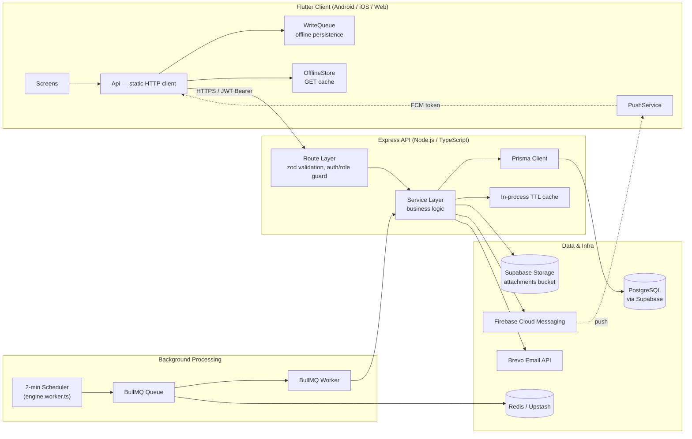

### 4.3 Data Flow

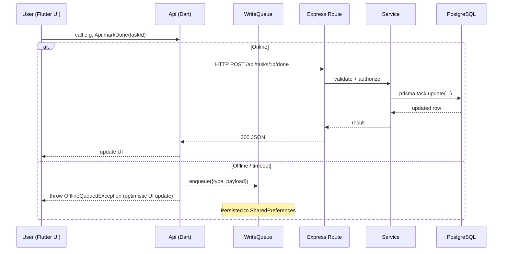

### 4.4 Dependency Flow

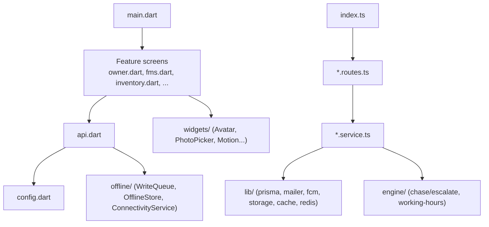

### 4.5 State Management Flow

See [§9](#9-state-management) for details — summarized here:

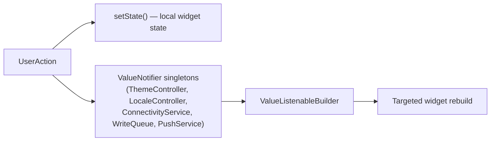

---

## 5. Feature Documentation

### 5.1 Authentication & Onboarding

| | |
|---|---|
| **Purpose** | Securely onboard a new company and its users; verify real email ownership; recover access without a help desk |
| **Workflow** | Signup → OTP verify → session token. Login → (if unverified) OTP verify → session. Forgot password → self-service OTP reset, or logged-out employees can request an owner/manager-approved reset |
| **Files (Flutter)** | `main.dart` (LoginScreen), `signup.dart`, `otp_verify.dart`, `forgot_password.dart`, `reset_requests.dart`, `change_password.dart`, `validators.dart`, `api.dart` |
| **Files (Backend)** | `modules/auth/auth.routes.ts`, `auth.service.ts`, `otp.service.ts`, `middleware/auth.ts`, `lib/mailer.ts` |
| **API used** | `/api/auth/*` (see [§7.1](#71-authentication-apiapiauth)) |
| **Validation** | Zod schemas server-side (`signupSchema`, `loginSchema`, `verifyOtpSchema`, …); mirrored email regex client-side in `validators.dart` |
| **Error handling** | Generic "Invalid credentials" (never reveals whether an email exists); `EmailNotVerifiedException` routes the client to the OTP screen instead of showing a raw error |
| **Business logic** | See [§8](#8-authentication-flow) |
| **UI Screens** | Login, Signup, OTP Verify, Forgot Password, Change Password, Reset Requests (approval) |
| **Navigation** | `LoginScreen` ⇄ `SignupScreen` / `ForgotPasswordScreen` → `OtpVerifyScreen` → `HomeScreen` |

### 5.2 Task Delegation & Automation Engine

| | |
|---|---|
| **Purpose** | Assign work and guarantee it doesn't silently die — the system chases, then escalates |
| **Workflow** | Owner/Manager creates a task (single or bulk) with a due date → engine computes `nextActionAt` → scheduler polls every 2 minutes → overdue tasks are chased (push + in-app notification), repeated chases escalate to the assignee's manager |
| **Files** | `owner.dart` (assign UI), `main.dart` (task list/home), `modules/task/task.route.ts`, `modules/engine/*` |
| **API used** | `/api/tasks/*` |
| **Validation** | `title` ≥ 2 chars, `assigneeId` must be a UUID belonging to the same org, `priority` ∈ `{HIGH, NORMAL, LOW}` |
| **Error handling** | 404 if assignee not in caller's org; 403 if a non-assignee tries to complete/stick a task |
| **Business logic** | Chase after 30 min overdue, repeat every 30 min, escalate to manager after 2 chases (or 60 min); working-hours aware (never pings outside shift hours/holidays) — see [§12.1](#121-automation-engine-chase--escalate) |
| **UI Screens** | Owner "Tasks" tab (assign/track/bulk-assign/stats), Employee "Tasks" tab (my tasks, mark done/stuck) |
| **Navigation** | Home → Tasks tab; Home → floating "Assign task" sheet |

### 5.3 Checklists (Recurring Compliance Tasks)

| | |
|---|---|
| **Purpose** | Enforce daily/weekly/monthly routines (opening checklist, weekly stock count, etc.) without manual reminders |
| **Workflow** | Owner/Manager defines a `ChecklistRule` (recurrence, time of day, assignee) → scheduler's `fireDueChecklists()` creates a `Task` with `source: CHECKLIST` when due → flows through the same chase/escalate engine as regular tasks |
| **Files** | `checklist.dart`, `modules/checklist/checklist.routes.ts`, `checklist.service.ts` |
| **API used** | `/api/checklists/*` |
| **Validation** | `recurrence` ∈ `{DAILY, WEEKLY, MONTHLY}`; `weekday` required for WEEKLY, `dayOfMonth` for MONTHLY |
| **Business logic** | Compliance % computed as done-vs-total checklist-sourced tasks in a window; feeds the Health Score's `CHECKLIST` component |
| **UI Screens** | Checklist list, create/edit rule, compliance view |

### 5.4 Flow Management System (FMS)

| | |
|---|---|
| **Purpose** | Model any multi-step order/production/service pipeline (e.g. Order Received → Cutting → Stitching → QC → Dispatch) without custom code per business |
| **Workflow** | Owner/Manager defines a `Flow` with ordered `StageDef`s (each with an optional responsible person, planned duration, and custom fields) → starting an `Order` creates it at stage 1 → completing a stage's custom-field form (`FieldDef`s: text/number/dropdown/date/photo/yes-no) advances the order to the next stage, computing a **working-hours-aware planned deadline** for it |
| **Files** | `fms.dart`, `order_history.dart`, `template_setup.dart`, `modules/fms/*` |
| **API used** | `/api/fms/*`, `/api/templates/*` |
| **Validation** | Stage `sequence` ordering enforced server-side; required `FieldDef`s must be present in `data` on stage completion |
| **Business logic** | `advanceOrder()` — deadline clock for stage N starts at stage N-1's *actual* completion time (never "now"), so an upstream delay correctly cascades downstream; unplanned stages (no `plannedMins`) get no deadline and are never chased. See [§12.2](#122-fms-order-progression) |
| **UI Screens** | Flow builder, Flow board (orders per stage), Order detail/history, Bottleneck & Cost-of-Delay analytics |
| **Navigation** | Home → Flows tab → Flow → Order → Stage completion sheet |

### 5.5 Inventory Management

| | |
|---|---|
| **Purpose** | Track stock levels, prevent stockouts/overstock, identify dead stock |
| **Workflow** | SKUs are created with optional min/max thresholds and unit cost → stock IN/OUT/ADJUST movements update `currentStock` and write an immutable `StockMovement` row (with running balance) → scheduler's `checkStockAlerts()` notifies owners/managers when a SKU crosses its min/max threshold |
| **Files** | `inventory.dart`, `modules/inventory/*` |
| **API used** | `/api/inventory/*` |
| **Validation** | Movement `quantity` must be positive; `type` ∈ `{IN, OUT, ADJUST}`; only `OWNER`/`MANAGER` or employees explicitly granted `canStockIn`/`canStockOut` may record movements |
| **Business logic** | `classifyLiquidVsDead()` — a SKU unmoved for 90+ days is "DEAD" stock, factored into the Health Score's `INVENTORY` component |
| **Offline support** | Stock movements are **queued offline** (`_writeOrQueue`) — critical for shop-floor use where connectivity is unreliable |
| **UI Screens** | SKU list (search/filter), SKU detail + movement history, record-movement sheet, inventory summary |

### 5.6 Analytics & Company Health Score

| | |
|---|---|
| **Purpose** | Turn raw operational data into decisions: who's underperforming, where orders bottleneck, is the business getting healthier or worse |
| **Workflow** | `/api/analytics/*` provides per-module breakdowns (employee performance, delegation, checklist, FMS, inventory) for an arbitrary date range. `/api/health-score` computes one weighted 0–100 score from 5 components (On-time %, Stuck load, Checklist compliance, Inventory health, Escalation rate) |
| **Files** | `analytics.dart`, `flow_analytics.dart`, `health_score.dart`, `modules/analytics/*`, `modules/health/*` |
| **Business logic** | Components with no data in the window are **excluded, not scored 0** — their weight is redistributed proportionally across components that do have data, so a module you haven't started using yet doesn't unfairly tank your score. Full formula in [§12.4](#124-company-health-score). A daily snapshot (`HealthSnapshot`) is written per org so the UI can show a trend arrow without recomputing history. |
| **UI Screens** | Health Score gauge (Home hub) + drill-down screen, Analytics dashboards with charts (`fl_chart`) |

### 5.7 Cost of Delay

| | |
|---|---|
| **Purpose** | Translate "this order is late" into "this order is costing you ₹X" — a number owners intuitively act on |
| **Workflow** | Org sets an optional ₹/hour rate (`delayCostPerHour`) in Settings, or a per-order `orderValue` is captured at order start. `/api/fms/analytics/cost-of-delay` prices each delayed order/stage using whichever basis is configured — **never fabricates a cost when neither is set** |
| **Files** | `widgets/cost_of_delay_info.dart`, `modules/fms/delay-cost.service.ts` |
| **UI Screens** | Cost-of-Delay analytics card, info tooltip explaining the calculation basis |

### 5.8 Offline Support

| | |
|---|---|
| **Purpose** | Keep the app usable on a factory floor / warehouse with patchy connectivity |
| **Workflow** | GET requests for key lists (tasks, checklists, orders, SKUs, FMS summary, Health Score) are cached locally (`OfflineStore`) and served as a fallback on connectivity failure. Writes for a small, safe set of actions (mark task done, record stock movement, complete an FMS stage) are queued (`WriteQueue`) and replayed **in FIFO order** the moment connectivity returns |
| **Files** | `offline/connectivity_service.dart`, `offline/write_queue.dart`, `offline/offline_store.dart`, `api.dart` |
| **Business logic** | The automation engine itself never runs offline — only the user's own writes are deferred. A queued action is dropped only if the server rejects it outright (a logical error retrying won't fix); connectivity failures leave it in place for the next sync attempt |

### 5.9 Push & In-App Notifications

| | |
|---|---|
| **Purpose** | Ensure a chase/escalation/alert reaches a person even if the app isn't open |
| **Workflow** | Every alert funnels through a single `notify()` function that writes a `Notification` row **and** sends an FCM push, in that order. Devices register/unregister their FCM token on login/logout (`/api/devices`); stale tokens (uninstalled app) are pruned automatically on send failure |
| **Files** | `push.dart`, `lib/fcm.ts`, `modules/engine/engine.service.ts` |

### 5.10 Superadmin Console

| | |
|---|---|
| **Purpose** | Give the Navish platform operator (not a company member) cross-org oversight |
| **Workflow** | A user with `isSuperAdmin = true` (settable only via a direct DB script, never an API) sees a dedicated console instead of the normal company UI: platform overview, org list, suspend/enable/delete an org, resolve account-deletion requests |
| **Files** | `admin.dart`, `modules/admin/admin.routes.ts` |
| **Security** | Gated by `requireSuperAdmin` — the *only* place in the codebase where cross-organization data access is permitted |

### 5.11 Legal & Data Deletion

| | |
|---|---|
| **Purpose** | Track Terms & Privacy consent; provide a GDPR-style "delete my account" path |
| **Workflow** | Signup requires `acceptedTerms: true`; the acceptance timestamp and legal version are recorded. Any authenticated user can file a self-service deletion request; the org owner (or a superadmin) actions it manually — deactivates the account (a soft delete, not a data wipe) |
| **Files** | `legal.dart`, `deletion_requests.dart`, `modules/legal/legal.routes.ts` |

---

## 6. Database / Backend

### 6.1 Entity-Relationship Overview

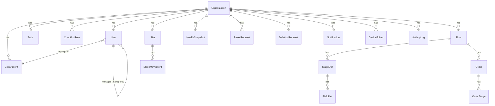

### 6.2 Core Tables

| Table | Purpose | Key Fields |
|---|---|---|
| `organizations` | One row per tenant company | `slug` (unique), `workingDays`, `shiftStart/End`, `holidays`, `delayCostPerHour`, `enabled` |
| `users` | People, org-scoped | `role` (`OWNER/MANAGER/EMPLOYEE`), `isSuperAdmin`, `emailVerified`, `canStockIn/Out` |
| `departments` | Org-scoped groupings of users | `name` unique per org |
| `otp_codes` | Hashed, short-lived verification codes | keyed by `(email, purpose)`, not org-scoped |
| `reset_requests` | Employee-initiated, owner/manager-approved password resets | `status: PENDING/APPROVED/DENIED` |
| `deletion_requests` | Self-service account deletion requests | `status: PENDING/COMPLETED/DENIED` |
| `tasks` | The engine's core unit | `source`, `status`, `nextActionAt`, `chaseCount`, `escalatedAt` |
| `notifications` | In-app notification feed | `readAt` nullable |
| `device_tokens` | FCM push tokens per user/device | `platform`: android/ios/web |
| `checklist_rules` | Recurring task templates | `recurrence`, `nextFireAt`, `lastFiredAt` |
| `flows` | FMS pipeline definitions | `prefix` (order numbering), `itemLabel` |
| `stage_defs` | Ordered stages within a Flow | `sequence`, `responsibleId`, `plannedMins` |
| `field_defs` | Custom form fields per stage | `type: TEXT/NUMBER/DROPDOWN/DATE/PHOTO/YESNO` |
| `orders` | An instance moving through a Flow | `orderNumber` unique per org, `orderValue` |
| `order_stages` | An order's visit to one stage | `data` (JSON custom fields), `plannedDeadline`, `delayMins` |
| `skus` | Inventory items | `currentStock`, `minStock`, `maxStock`, `unitCost`, `lastMovedAt` |
| `stock_movements` | Immutable ledger of stock changes | `type: IN/OUT/ADJUST`, `balance` (running total) |
| `health_snapshots` | One daily score per org | unique on `(orgId, date)` |
| `activity_logs` | Audit trail | `action`, `entity`, `meta` (JSON) |

### 6.3 Relationships

- **Organization → everything**: nearly every table has `orgId` with `onDelete: Cascade` — deleting an org cleans up all its data.
- **User → User** (`managerId`, relation `ManagerChain`): a self-referencing tree used for escalation routing (escalate to *your* manager, never straight to the owner).
- **Flow → StageDef → FieldDef**: a 3-level definition hierarchy describing *what a pipeline looks like*.
- **Flow → Order → OrderStage**: the corresponding 3-level *instance* hierarchy describing *what actually happened*.
- **Sku → StockMovement**: one-to-many immutable ledger; `Sku.currentStock` is a derived/cached total kept in sync on each movement.

### 6.4 CRUD Operations

All CRUD goes through Prisma Client inside `*.service.ts` files, scoped by `orgId` on every query (multi-tenancy is enforced in application code — Postgres Row-Level Security is **not** used). Example pattern used throughout:

```ts
// Every read/write is scoped to the caller's org — never trust a bare :id
const task = await prisma.task.findFirst({
  where: { id: req.params.id, orgId: req.user!.orgId },
});
```

### 6.5 Security Rules

- No direct client → database access exists; the Flutter app **only** talks to the Express API.
- The Supabase **service role key** (`SUPABASE_SERVICE_KEY`) lives only on the backend and is never sent to the client.
- Every query in a route handler filters by `req.user.orgId`, except the superadmin-only `/api/admin/*` routes, which are the sole intentional exception.

### 6.6 Example JSON — `Order` with nested `OrderStage`

```json
{
  "id": "6d1e2f3a-...",
  "orgId": "b2a9...",
  "flowId": "f1a0...",
  "orderNumber": "ORD-014",
  "status": "ACTIVE",
  "currentStageId": "st-002",
  "startedAt": "2026-07-20T04:12:00.000Z",
  "orderValue": 18500,
  "stages": [
    {
      "id": "os-101",
      "stageId": "st-001",
      "sequence": 1,
      "enteredAt": "2026-07-20T04:12:00.000Z",
      "completedAt": "2026-07-20T06:40:00.000Z",
      "plannedDeadline": "2026-07-20T07:12:00.000Z",
      "delayMins": null,
      "data": { "cuttingMachine": "M-2", "operator": "Ravi" }
    },
    {
      "id": "os-102",
      "stageId": "st-002",
      "sequence": 2,
      "enteredAt": "2026-07-20T06:40:00.000Z",
      "completedAt": null,
      "plannedDeadline": "2026-07-20T09:40:00.000Z",
      "data": null
    }
  ]
}
```

---

## 7. API Documentation

All endpoints are prefixed with the backend's base URL (see [§17](#17-environment-configuration)) and, unless marked **Public**, require:

```
Authorization: Bearer <JWT>
```

Role column: 🟢 any authenticated user · 🟡 `OWNER`/`MANAGER` · 🔴 `OWNER` only · 🟣 superadmin only · ⚪ public (no token)

### 7.1 Authentication API (`/api/auth`)

| Method | Endpoint | Role | Description |
|---|---|---|---|
| POST | `/signup` | ⚪ | Create a new company + Owner account (unverified) |
| POST | `/login` | ⚪ | Log in; returns `403 EMAIL_NOT_VERIFIED` if the account needs OTP verification |
| POST | `/verify-otp` | ⚪ | Complete SIGNUP or LOGIN_VERIFY with a 6-digit code → returns JWT |
| POST | `/resend-otp` | ⚪ | Resend the pending SIGNUP/LOGIN_VERIFY code (60s cooldown) |
| POST | `/forgot-password` | ⚪ | Send a PASSWORD_RESET OTP (always 200, never reveals if the email exists) |
| POST | `/reset-password` | ⚪ | Reset password using the OTP code |
| GET | `/me` | 🟢 | Current user's profile |
| PATCH | `/me` | 🟢 | Update own profile (name, nickname, designation, language, phone, photo) |
| POST | `/change-password` | 🟢 | Change password (requires current password) |
| POST | `/request-reset` | ⚪ | Employee: request an owner/manager-approved password reset |
| GET | `/reset-requests` | 🟡 | List pending reset requests for the org |
| POST | `/reset-requests/:id/approve` | 🟡 | Approve → generates & returns a temp password (relayed out-of-band) |
| POST | `/reset-requests/:id/deny` | 🟡 | Deny a reset request |
| POST | `/request-deletion` | 🟢 | Self-service: request own account deletion |
| GET | `/deletion-requests` | 🔴 | List pending deletion requests |
| POST | `/deletion-requests/:id/complete` | 🔴 | Approve deletion → deactivates account |
| POST | `/deletion-requests/:id/deny` | 🔴 | Deny a deletion request |

**Example — `POST /api/auth/signup`**

Request:
```json
{
  "companyName": "Ravi Textiles",
  "ownerName": "Ravi Kumar",
  "email": "ravi@example.com",
  "password": "SecurePass123",
  "phone": "9876543210",
  "acceptedTerms": true
}
```

Response `201`:
```json
{ "message": "Account created — enter the code we emailed you to verify.", "email": "ravi@example.com" }
```

Error `409` (duplicate email in org):
```json
{ "error": "That email is already registered for this company" }
```

### 7.2 Users API (`/api/users`)

| Method | Endpoint | Role | Description |
|---|---|---|---|
| GET | `/` | 🟢 | List org users |
| POST | `/` | 🔴 | Invite/create a new user |
| PATCH | `/:id/inventory-permissions` | 🟡 | Grant/revoke `canStockIn`/`canStockOut` |

### 7.3 Tasks API (`/api/tasks`)

| Method | Endpoint | Role | Description |
|---|---|---|---|
| POST | `/` | 🟡 | Create & assign a task |
| POST | `/bulk` | 🟡 | Assign the same task to multiple people |
| GET | `/my` | 🟢 | My tasks (`?status=ACTIVE\|DONE&from=&to=`) |
| GET | `/all` | 🟡 | All org tasks (filterable) |
| GET | `/stats` | 🟡 | Per-employee performance aggregates |
| POST | `/:id/done` | 🟢 | Mark complete (assignee only) — stops chasing |
| POST | `/:id/stuck` | 🟢 | Mark stuck with a reason (assignee only) |
| GET | `/notifications` | 🟢 | My notification feed |

### 7.4 Checklists API (`/api/checklists`)

| Method | Endpoint | Role | Description |
|---|---|---|---|
| POST | `/` | 🟡 | Create a recurring checklist rule |
| GET | `/` | 🟢 | List checklist rules |
| GET | `/:id/compliance` | 🟡 | Compliance % for a rule |
| PATCH | `/:id` | 🟡 | Update assignee/active state |
| POST | `/:id/toggle` | 🟡 | Enable/disable a rule |

### 7.5 FMS API (`/api/fms`)

| Method | Endpoint | Role | Description |
|---|---|---|---|
| POST | `/flows` | 🟡 | Create a Flow (with stages + fields) |
| GET | `/flows` | 🟢 | List flows |
| PATCH | `/stages/:id` | 🟡 | Reassign a stage's responsible person |
| POST | `/flows/:flowId/orders` | 🟢 | Start a new order in a flow |
| GET | `/orders` | 🟢 | List orders (filterable) |
| POST | `/orderstages/:id/complete` | 🟢 | Submit a stage's data → advances the order |
| GET | `/orders/:id/history` | 🟢 | Full stage-by-stage timeline for an order |
| GET | `/bottlenecks` | 🟡 | Stages with the worst average delay |
| GET | `/analytics/summary` | 🟡 | KPI counts (pending/completed/delayed/on-time) |
| GET | `/analytics/orders` | 🟡 | Drill-down order list by category |
| GET | `/analytics/cost-of-delay` | 🟡 | ₹ cost of delay breakdown |

**Example — `POST /api/fms/orderstages/:id/complete`**

Request:
```json
{ "data": { "qcResult": "Pass", "inspector": "Meena" }, "remarks": "Minor rework on batch 3" }
```

Response `200`: the updated `OrderStage`, and — server-side — the order is advanced to its next stage (or completed) automatically.

### 7.6 Inventory API (`/api/inventory`)

| Method | Endpoint | Role | Description |
|---|---|---|---|
| GET | `/skus` | 🟢 | List SKUs (`?search=&category=&status=ALL\|LOW\|OVER`) |
| POST | `/skus` | 🟡 | Create a SKU |
| PATCH | `/skus/:id` | 🟡 | Update a SKU |
| POST | `/skus/:id/movement` | 🟢* | Record IN/OUT/ADJUST (*requires `canStockIn/Out` if EMPLOYEE) |
| GET | `/skus/:id/history` | 🟢 | Movement history for a SKU |
| GET | `/summary` | 🟡 | Inventory-wide summary (value, alerts, dead stock) |

### 7.7 Other Modules (summary)

| Module | Base path | Highlights |
|---|---|---|
| Stuck | `/api/stuck` | 🟡 GET — aggregated overdue/escalated items across all modules |
| Devices | `/api/devices` | 🟢 POST/DELETE — FCM token register/unregister |
| Settings | `/api/settings` | 🔴 GET/PATCH/DELETE — org profile, working hours, Cost-of-Delay rate |
| Admin | `/api/admin` | 🟣 overview, org list/detail, suspend/delete org, deletion requests |
| Analytics | `/api/analytics` | 🟢/🟡 `employees`, `delegation`, `checklists`, `fms`, `inventory` (date-ranged) |
| Export | `/api/export` | 🟢/🔴 `fms/:flowId`, `inventory/movements`, `tasks` (Excel/CSV), `backup` (full org zip, Owner only) |
| Templates | `/api/templates` | 🟢/🟡 list pre-built Flow/checklist templates, apply one |
| Health Score | `/api/health-score` | 🟢 `?days=7` windowed company health score |
| Legal | `/legal` | ⚪ `/terms`, `/privacy` static text |
| Uploads | `/api/uploads` | 🟢 multipart image upload → Supabase Storage URL |

### 7.8 Standard Error Format

```json
{ "error": "Human-readable message", "details": [ /* zod issues, validation errors only */ ] }
```

| HTTP Status | Meaning |
|---|---|
| 400 | Validation failed / bad input |
| 401 | Missing, invalid, or expired token; wrong credentials |
| 403 | Authenticated but not authorized (role, ownership, unverified email, suspended org) |
| 404 | Resource not found (or not in caller's org — never distinguished, to avoid leaking existence) |
| 409 | Unique-constraint conflict (e.g. duplicate email in org) |
| 429 | OTP resend requested too soon |
| 500 | Unhandled server error |

---

## 8. Authentication Flow

### 8.1 Signup + Email Verification

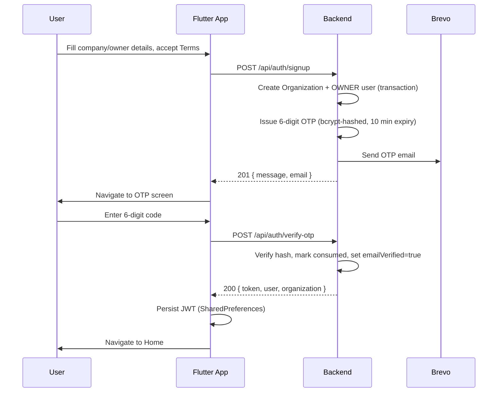

### 8.2 Login (Verified vs. Unverified)

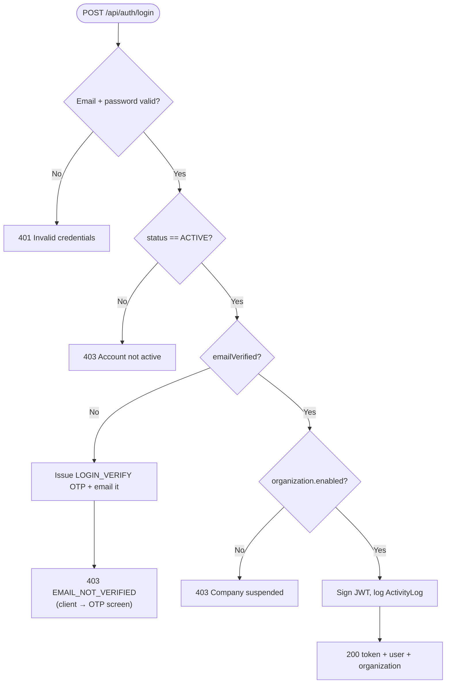

### 8.3 Forgot Password (Self-Service, OTP)

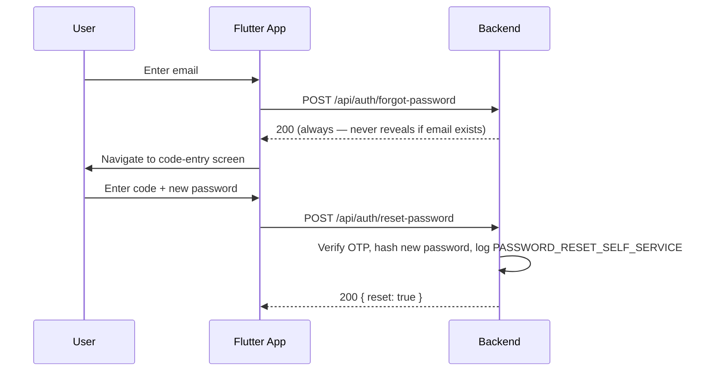

### 8.4 Owner/Manager-Approved Reset (logged-out employee)

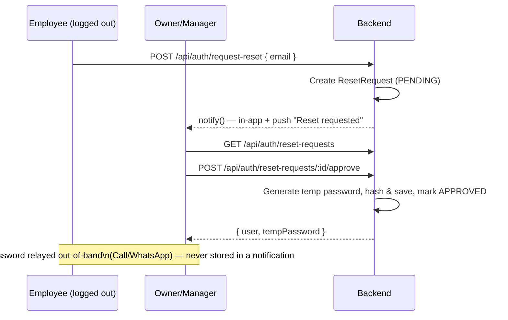

### 8.5 Session Management
- JWT payload: `{ userId, orgId, role, isSuperAdmin }`, signed with `JWT_SECRET`, default expiry `7d` (`JWT_EXPIRES_IN`).
- The token is sent as `Authorization: Bearer <token>` on every authenticated request and persisted client-side via `shared_preferences`.
- There is no refresh-token flow — a token simply stops working at expiry and the user is prompted to log in again (stateless, no server-side session store/blacklist).

### 8.6 Logout
Client-side only: the token is deleted from `SharedPreferences` (`Api.logout()`) and the FCM device token is unregistered (`PushService.unregisterToken()`) before navigating back to `LoginScreen`. The server does not need to be informed — JWTs are stateless.

---

## 9. State Management

### 9.1 Approach
Navish's Flutter app deliberately uses **no state-management framework** (no Bloc, Riverpod, or GetX). It relies on:

1. **`StatefulWidget` + `setState()`** for screen-local state (the overwhelming majority of state in the app).
2. **`ValueNotifier` singletons** for a small number of genuinely global, cross-screen concerns:
   - `ThemeController.mode` — light/dark/system
   - `LocaleController.locale` — en/hi
   - `ConnectivityService.isOnline` — online/offline
   - `WriteQueue.pendingCount` / `WriteQueue.syncing` — offline sync status
   - `PushService.pendingTap` — a tapped push notification's payload, consumed once

`provider: ^6.1.5` is a listed dependency but is not actively used for app-wide state — the codebase favors `ValueListenableBuilder` directly over the singletons above.

### 9.2 Why This Approach
For a CRUD-heavy, screen-per-feature app with a small team, a full state-management framework adds indirection without a matching payoff. Each screen already owns its data lifecycle (load in `initState`, refresh via `RefreshIndicator`), and the few things that genuinely need to be global are few enough to hand-roll with `ValueNotifier`.

### 9.3 Flow Example

```dart
// Global: theme_controller.dart
class ThemeController {
  static final ValueNotifier<ThemeMode> mode = ValueNotifier(ThemeMode.system);
  static Future<void> set(ThemeMode m) async { ... persist + mode.value = m ... }
}

// Consumption: main.dart
ValueListenableBuilder<ThemeMode>(
  valueListenable: ThemeController.mode,
  builder: (_, mode, __) => MaterialApp(themeMode: mode, ...),
)
```

Screen-local example (`HomeScreen`): `_user`, `_tasks`, `_notifs`, `_loading` are plain fields updated via `setState()` inside `_load()`, which fires four API calls in parallel with `Future.wait`.

### 9.4 Best Practices Followed
- Keep `ValueNotifier` scope as narrow as possible — only truly cross-cutting state is global.
- Wrap only the smallest subtree that needs to rebuild in a `ValueListenableBuilder` (see the nested builders in `_offlineBanner()`).
- Never store server data in a global notifier — it's always fetched and held locally per screen, keeping "source of truth" unambiguous (the server).

---

## 10. Routing

### 10.1 Navigation Model
Navish uses **imperative navigation** — `Navigator.push` / `pushReplacement` / `pushAndRemoveUntil` — not a declarative router (no `go_router`/`Navigator 2.0`). There are no named routes; screens are pushed as widget instances directly, which keeps type-safe parameter passing trivial (e.g. `OtpVerifyScreen(email: e.email)`) at the cost of no deep-linking support beyond push-notification tap handling.

Custom transitions are centralized in `widgets/motion.dart`'s `sharedAxisRoute()` helper (a shared-axis fade+slide transition used for nearly every push in the app), so navigation feels consistent without repeating `PageRouteBuilder` boilerplate.

### 10.2 Navigation Flow

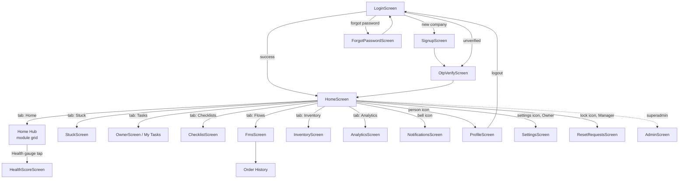

### 10.3 Special Navigation Behaviors
- **Back-button handling** (`PopScope`): on any non-Home tab, back returns to the Home tab; on Home, a second back-press within 2 seconds exits the app (Android "press back again to exit" pattern).
- **Push-notification deep link**: a tapped notification sets `PushService.pendingTap`, which `HomeScreen` consumes to jump to the relevant module tab (e.g. `INVENTORY_ALERT` → Inventory tab).
- **Post-logout stack reset**: `Navigator.pushAndRemoveUntil(..., (route) => false)` clears the entire stack so a back-press after logout can never reveal a stale authenticated screen.

---

## 11. UI Components

Reusable widgets live in `app/lib/widgets/`.

### 11.1 `AppAvatar` (`avatar.dart`)
| | |
|---|---|
| **Purpose** | Consistent network-image avatar for profile photos / company logos everywhere in the app |
| **Properties** | `imageUrl`, `radius`, `heroTag`, `fallbackText`, `fallbackIcon`, `enableViewer` |
| **Behavior** | Cached (`cached_network_image`), shimmer placeholder while loading, **one automatic retry** on failure (covers a Render cold-start / transient Supabase hiccup) before falling back to initials, tap opens a full-screen `Hero`-animated viewer |
| **Example** | `AppAvatar(imageUrl: user['photoUrl'], radius: 28, heroTag: 'profile-${user['id']}', fallbackText: user['name'])` |

### 11.2 `pickAndCropSquareImage` (`photo_picker.dart`)
| | |
|---|---|
| **Purpose** | Shared pick → crop (1:1) → compress pipeline for profile photos and company logos |
| **Behavior** | Gallery picker → `image_cropper` square crop → export at max 1024px, JPEG quality 85; returns `null` if cancelled at either step; web crop dialog is sized off the viewport to avoid overflow on short browser windows |
| **Example** | `final bytes = await pickAndCropSquareImage(context, toolbarTitle: 'Crop photo');` |

### 11.3 `FullScreenPhotoViewer` (`photo_viewer.dart`)
Full-screen, pinch-zoomable (`photo_view`) image viewer with a `Hero` transition matching the tapped avatar/thumbnail's tag.

### 11.4 Motion primitives (`motion.dart`)
| Widget/Function | Purpose |
|---|---|
| `sharedAxisRoute(page)` | Standard push transition used across the app |
| `PressableScale` | Subtle scale-down-on-tap wrapper for cards/buttons |
| `StaggeredListItem` | Entrance animation for list items, staggered by index |
| `FadeThroughSwitcher` | Cross-fade between tab bodies |
| `PulseOnChange` | Pulses a widget (e.g. the notification badge) when its `value` changes |
| `reducedMotion(context)` | Respects OS-level "reduce motion" accessibility setting |
| `playDoneConfirmation()` | Micro-interaction played before a "mark done" action resolves |

### 11.5 `CostOfDelayInfo` (`cost_of_delay_info.dart`)
An explainer widget (info icon + sheet) that tells the owner exactly which basis (org-wide ₹/hr rate vs. per-order value) was used to compute a shown Cost-of-Delay figure.

---

## 12. Business Logic

### 12.1 Automation Engine (Chase / Escalate)
**File:** `backend/src/modules/engine/engine.service.ts`, `engine.config.ts`, `engine.worker.ts`, `working-hours.ts`

```mermaid
stateDiagram-v2
    [*] --> PENDING: Task created (nextActionAt = dueAt + 30min, working-hours-aware)
    PENDING --> IN_PROGRESS
    PENDING --> STUCK: assignee flags stuck (reason required)
    IN_PROGRESS --> STUCK
    PENDING --> CHASED: nextActionAt reached (2-min scheduler tick)
    CHASED --> CHASED: repeat every 30 min\n(chaseCount++, still working hours)
    CHASED --> ESCALATED: chaseCount >= 2 (MAX_CHASES_BEFORE_ESCALATE)
    ESCALATED --> [*]: notified to assignee's manager\n(never the Owner directly);\nno manager → chasing stops
    PENDING --> DONE: assignee marks done
    CHASED --> DONE
    STUCK --> DONE
    DONE --> [*]
```

Key rules:
- Every notification funnels through one `notify()` function (in-app row + FCM push) — new alert types must be wired here, never call `sendPush()` directly.
- `applyWorkingHours()` pushes any computed reminder time out of non-working hours/holidays — **no 2 a.m. pings**.
- A background **BullMQ** worker (Redis-backed) actually executes each chase/escalate job; a lightweight in-process `setInterval` (every 2 minutes) is the scheduler that finds due tasks and enqueues jobs — decoupling "what's due" from "doing the work" so a slow job can't block the scan.

### 12.2 FMS Order Progression
**File:** `backend/src/modules/fms/fms.service.ts` (`advanceOrder`)

- The deadline clock for stage *N* starts at stage *N‑1*'s **actual** completion time (or the order's `startedAt` for stage 1) — never "now" — so a late upstream stage correctly cascades its lateness downstream.
- Unplanned stages (`plannedMins == null`) get no deadline and are never chased, but their `completedAt` still feeds the next stage's clock.
- Completing the last stage marks the `Order` `COMPLETED`.

### 12.3 Working Hours Gate
**File:** `backend/src/modules/engine/working-hours.ts`

Every computed "when should this ping fire" timestamp (first action, repeat chase, FMS stage deadline) is passed through `applyWorkingHours()` / `addWorkingTimeForOrg()`, which respects the org's configured `workingDays`, `shiftStart`/`shiftEnd`, and `holidays` — durations are measured in **working minutes**, not wall-clock minutes.

### 12.4 Company Health Score
**File:** `backend/src/modules/health/health-score.service.ts`

Five weighted components (nominal weights sum to 100):

| Component | Weight | What it measures |
|---|---|---|
| On-time performance | 30 | % of tasks/planned FMS stages finished without escalation/late |
| Stuck / overdue load | 25 | Current count of stuck items (HIGH severity weighted 2×), −8 pts per weighted unit |
| Checklist compliance | 15 | % of checklist-sourced tasks completed in-window |
| Inventory health | 15 | % of SKUs in alert + % of stock value classified DEAD (90+ days unmoved) |
| Escalations | 15 | Escalation rate in-window, −2 pts per 1% escalated |

A component with **zero data** in the window is *excluded* (not scored 0); its weight is redistributed proportionally across included components. Final score bands: `≥85 HEALTHY`, `≥60 NEEDS_ATTENTION`, `<60 AT_RISK`. The top 3 "drags" (points lost) are surfaced for drill-down.

### 12.5 Services / Controllers / Repositories / Validators mapping

| Concept | Where it lives in this codebase |
|---|---|
| Controllers | `*.routes.ts` — request parsing, Zod validation, auth/role guards, response shaping |
| Services | `*.service.ts` — business rules, orchestration, Prisma calls |
| Repositories | Not a separate layer — Prisma Client fills this role directly inside services |
| Utilities | `lib/*.ts` (mailer, fcm, storage, cache, listFilters, exportUtils) |
| Validators | Zod schemas defined inline at the top of each `*.routes.ts`; shared ones (e.g. `emailSchema`) in `lib/validation.ts` |

---

## 13. Error Handling

### 13.1 Backend
- **Validation errors** — Zod `safeParse()` at the top of every route handler; failures return `400` with a `details` array of Zod issues.
- **Expected business errors** — thrown as `Object.assign(new Error(message), { status, ...extra })` and caught by Express's centralized error middleware (`index.ts`), which reads `.status`/`.message` off the error.
- **Prisma unique-constraint violations** (`P2002`) are special-cased in the error middleware to a friendly `409` message.
- **Unexpected errors** — logged via `console.error(err.stack)`, returned as `500` with `error.message`; `name`/`code` are only included outside `production`, to avoid leaking internals.
- **Best-effort side effects** (e.g. sending a push after approving a reset) are wrapped so their failure never fails the primary request.

### 13.2 Frontend (Flutter)
- **Network/connectivity errors** — detected via `isConnectivityError()` (`SocketException`, `TimeoutException`, `http.ClientException`) in `offline/write_queue.dart`, distinguishing "you're offline" from "the server rejected this."
- **Custom exceptions**:
  - `EmailNotVerifiedException` — routes the login flow to the OTP screen instead of showing a raw error.
  - `OfflineQueuedException` — signals a write was queued, not failed; UI proceeds optimistically.
- **Generic errors** — `Api` methods throw `Exception(data['error'] ?? 'fallback message')`; screens catch and show a `SnackBar`, stripping the `Exception:` prefix for display.
- **Read fallback** — `_cachedGet()` serves the last-known-good cached response on a connectivity failure rather than showing an error screen.

### 13.3 Retry / Resilience
- Backend scheduler tick: a failure in one tick is caught and logged; the *next* tick (2 minutes later) simply tries again — no crash, no manual restart needed.
- `AppAvatar`: one automatic image-load retry after a 2-second delay before falling back to initials.
- `WriteQueue.flush()`: stops (preserving order) on the first connectivity failure so nothing is lost or reordered; drops an action only on an explicit server rejection.

---

## 14. Performance Optimizations

| Technique | Where | Effect |
|---|---|---|
| **Parallel data fetching** | `HomeScreen._load()` uses `Future.wait` for tasks/notifications/stuck-count/health-score instead of sequential awaits | Home screen loads in the time of the *slowest* call, not the sum |
| **Aggregate queries over N+1** | `/api/tasks/stats` uses 4 `groupBy` queries (one per metric, covering all assignees) instead of 4 queries *per employee* | O(1) DB round-trips instead of O(N) |
| **In-process TTL cache** | `lib/cache.ts`, used by analytics aggregates | Avoids recomputing expensive aggregates on every tab reopen within a few minutes |
| **Offline GET cache** | `OfflineStore` / `Api._cachedGet` | Instant render of last-known data instead of a spinner/error when offline |
| **Image caching** | `cached_network_image` in `AppAvatar` | Already-seen images render instantly, no re-fetch |
| **Image compression before upload** | `image_cropper` export settings (max 1024px, JPEG q85) | Smaller uploads, faster subsequent loads |
| **`const` widgets** | Used throughout static UI (e.g. `const SizedBox`, `const Icon`) | Reduces widget-tree rebuild cost |
| **Bounded queue history** | `removeOnComplete`/`removeOnFail` on the BullMQ worker | Prevents unbounded Redis key growth (Upstash bills per command/storage) |
| **Tuned Redis polling** | `drainDelay: 60`, `stalledInterval: 300_000` on the BullMQ worker | Cuts idle Redis chattiness ~12× versus defaults, since jobs only ever arrive from a 2-minute scheduler tick |
| **List result limits** | `.take(50)`/`.take(100)`/`.take(200)` on list queries | Bounds response size and query cost |
| **Optional perf diagnostic** | `PERF_LOG=1` env flag logs per-request timing | Opt-in, zero overhead when unset |

---

## 15. Security

### 15.1 Authentication
- Passwords hashed with `bcryptjs` (cost factor 10) — plaintext never stored, including admin-generated temp passwords.
- Session tokens are JWTs signed with a server-only `JWT_SECRET`, default 7-day expiry.
- Email ownership is proven via a hashed, time-limited (10 min), attempt-limited (5 tries) OTP before a session is ever issued for a new or first-time account.
- Login/signup responses never reveal whether an email exists in the system ("Invalid credentials" / generic 200 either way).

### 15.2 Authorization
- `requireAuth` — verifies the JWT on every protected route.
- `requireRole(...roles)` — role-gates specific endpoints (`OWNER`, `MANAGER`, `EMPLOYEE`).
- `requireSuperAdmin` — the sole gate permitting cross-organization access, used only by `/api/admin/*`.
- `isSuperAdmin` is **never settable via any API** — only by a direct database script (`scripts/set-superadmin.mjs`), preventing privilege escalation through the app.
- Every data query is explicitly scoped by `orgId` from the verified JWT, not from client-supplied input.

### 15.3 Input Validation
- All request bodies are validated with **Zod** schemas before touching the database.
- Email format is validated both server-side (`lib/validation.ts`) and client-side (`validators.dart`) with matching regexes.
- Uploaded file content-type is enforced server-side (multer `fileFilter`) to only accept `image/*`.

### 15.4 Secure Storage
- JWT stored client-side in `shared_preferences` (standard practice for mobile; acceptable given the app is not a high-security banking context).
- Backend secrets (`JWT_SECRET`, `SUPABASE_SERVICE_KEY`, `BREVO_API_KEY`, DB credentials) live only in server-side environment variables, never bundled into the client or committed to source control (`.env` and `firebase-key.json` are git-ignored).
- The Supabase **service role key** stays server-side only; the client never receives it or talks to Supabase directly.

### 15.5 API Security
- CORS is enabled (`cors()` middleware) — currently permissive; consider restricting to known origins in production (see [§19 Known Issues](#19-known-issues)).
- Rate-limiting is applied narrowly today (OTP resend cooldown, max verification attempts) rather than globally across the API.
- Errors avoid leaking stack traces / internal error names/codes in production responses.

### 15.6 XSS / CSRF Considerations
- The API is a pure JSON REST service (no server-rendered HTML with user input), which inherently avoids classic reflected-XSS vectors.
- Flutter Web renders through the Flutter engine (canvas/DOM abstraction), not raw HTML injection, which limits DOM-based XSS surface for app content.
- CSRF is not applicable in the traditional cookie-session sense — auth is a bearer token explicitly attached per request, not an ambient cookie.
- OTP emails are sent as controlled HTML templates (`otpEmailHtml()`) with no user-supplied HTML interpolated into them beyond the user's own name.

---

## 16. Installation Guide

### 16.1 Prerequisites
| Tool | Version |
|---|---|
| Flutter SDK | Compatible with Dart `^3.12.2` (Flutter 3.24+ recommended) |
| Node.js | 20+ (backend uses `@types/node ^26`, TypeScript `^5.9`) |
| PostgreSQL | via a Supabase project (or any Postgres instance) |
| Redis | e.g. Upstash (for the BullMQ job queue) |
| Firebase project | for push notifications (Android/iOS/Web) |
| Brevo account | for transactional email (OTP/reset) |

### 16.2 Clone the Repository
```bash
git clone <repository-url>
cd NAVISH-AUTOMATION
```

### 16.3 Backend Setup
```bash
cd backend
npm install
# create backend/.env — see §17 for required variables
npx prisma generate
npx prisma migrate deploy   # or `migrate dev` in local development
npm run dev                  # starts on http://localhost:4000
```

### 16.4 Flutter App Setup
```bash
cd app
flutter pub get
flutter gen-l10n              # regenerate localizations if .arb files changed
flutter run                   # debug run, hits local backend by platform default (see Config.apiBase)
```

To point the app at a specific backend (e.g. a physical device on your LAN):
```bash
flutter run --dart-define=API_BASE=http://192.168.1.21:4000
```

### 16.5 Build for Release
```bash
# Android
flutter build apk --release
flutter build appbundle --release

# iOS
flutter build ios --release

# Web
flutter build web --release
```

### 16.6 Deploy
See [§22 Deployment Guide](#22-deployment-guide).

---

## 17. Environment Configuration

### 17.1 Backend — `backend/.env`

| Variable | Required | Purpose |
|---|---|---|
| `DATABASE_URL` | ✅ | Prisma pooled Postgres connection string (Supabase) |
| `DIRECT_URL` | ✅ | Prisma direct (non-pooled) connection string, used for migrations |
| `JWT_SECRET` | ✅ | Signing secret for session JWTs |
| `JWT_EXPIRES_IN` | optional (default `7d`) | Session token lifetime |
| `PORT` | optional (default `4000`) | HTTP port the API listens on |
| `SUPABASE_URL` | ✅ | Supabase project URL |
| `SUPABASE_SERVICE_KEY` | ✅ | Supabase **service role** key — server-side only, never exposed to the client |
| `REDIS_URL` | ✅ (for the job queue) | Redis connection string (Upstash-compatible) for BullMQ |
| `BREVO_API_KEY` | recommended | Brevo transactional email API key — without it, email sending no-ops with a warning |
| `MAIL_FROM` | optional | From-address for outgoing email |
| `MAIL_FROM_NAME` | optional | From-name for outgoing email |
| `GMAIL_USER` / `GMAIL_APP_PASSWORD` | legacy/unused | Superseded by Brevo (Gmail SMTP was blocked by Render's egress rules) |
| `FIREBASE_SERVICE_ACCOUNT` | optional | Firebase service-account JSON as a string — used in production where `firebase-key.json` isn't deployed |
| `PERF_LOG` | optional | Set to `1` to log per-request timing diagnostics |
| `NODE_ENV` | optional | `production` suppresses internal error detail (`name`/`code`) in API error responses |

> ⚠️ Never commit `.env` or `firebase-key.json` — both are git-ignored. Rotate any secret that may have been exposed.

### 17.2 Flutter — build-time configuration

| Variable | How it's set | Purpose |
|---|---|---|
| `API_BASE` | `--dart-define=API_BASE=...` | Overrides the backend base URL for any target (physical device on LAN, staging, etc.) |

Default resolution (`config.dart`) when `API_BASE` is not passed:
- Release build → the deployed production backend URL.
- Debug/profile, Android emulator → `http://10.0.2.2:4000`.
- Debug/profile, Web/other → `http://localhost:4000`.

### 17.3 Firebase Configuration
- `app/firebase.json` maps the Flutter project to Firebase project `navish-e092f` for Android/iOS.
- `app/lib/firebase_options.dart` is **generated** by the FlutterFire CLI — regenerate it (`flutterfire configure`) if Firebase project settings change, don't hand-edit it.
- Android needs `google-services.json`; iOS needs `GoogleService-Info.plist` (both platform-specific, not checked into this documentation for security).

---

## 18. Dependencies

### 18.1 Flutter (`app/pubspec.yaml`)

| Package | Purpose | Version |
|---|---|---|
| `http` | REST API calls | `^1.6.0` |
| `http_parser` | MIME type parsing for multipart uploads | `^4.1.2` |
| `shared_preferences` | Local key-value persistence (JWT, theme, locale, offline queue/cache) | `^2.5.5` |
| `provider` | Listed dependency (see [§9](#9-state-management) — minimally used) | `^6.1.5+1` |
| `intl` | Date/number formatting, localization support | `^0.20.2` |
| `image_picker` | Gallery/camera image selection | `^1.2.0` |
| `firebase_core` | Firebase SDK initialization | `^4.12.0` |
| `firebase_messaging` | Push notifications | `16.4.1` |
| `url_launcher` | Open external links / dialer / WhatsApp | `^6.3.2` |
| `fl_chart` | Analytics charts | `^1.2.0` |
| `share_plus` | Native share sheet (exports) | `^13.2.0` |
| `path_provider` | Filesystem paths for exported files | `^2.1.6` |
| `connectivity_plus` | Online/offline detection | `^7.3.0` |
| `uuid` | Client-generated IDs for the offline write queue | `^4.6.0` |
| `barcode_widget` | Barcode rendering (inventory/order labels) | `^2.0.4` |
| `google_fonts` | Typography | `^6.2.1` |
| `flutter_animate` | Declarative entrance/interaction animations | `^4.5.2` |
| `animations` | Material motion transitions | `^2.0.11` |
| `shimmer` | Loading placeholders | `^3.0.0` |
| `cached_network_image` | Cached avatar/image loading | `^3.4.1` |
| `image_cropper` | Square crop pipeline for photos/logos | `^9.1.0` |
| `photo_view` | Pinch-to-zoom full-screen viewer | `^0.15.0` |
| `cupertino_icons` | iOS-style icon set | `^1.0.8` |
| `flutter_localizations` (SDK) | en/hi localization | Flutter SDK |
| `flutter_lints` / `flutter_launcher_icons` (dev) | Linting / app icon generation | `^6.0.0` / `^0.14.3` |

### 18.2 Backend (`backend/package.json`)

| Package | Purpose | Version |
|---|---|---|
| `express` | HTTP server / routing | `^5.2.1` |
| `@prisma/client` / `prisma` | ORM client + CLI | `^6.16.2` |
| `pg` | Postgres driver (used by Prisma) | `^8.22.0` |
| `@supabase/supabase-js` | Storage client | `^2.110.2` |
| `bcryptjs` | Password/OTP hashing | `^3.0.3` |
| `jsonwebtoken` | JWT sign/verify | `^9.0.3` |
| `zod` | Runtime request validation | `^4.4.3` |
| `cors` | CORS middleware | `^2.8.6` |
| `multer` | Multipart file upload handling | `^2.2.0` |
| `bullmq` | Background job queue | `^5.80.1` |
| `ioredis` | Redis client (BullMQ connection) | `^5.11.1` |
| `firebase-admin` | Server-side push (FCM) | `^14.1.0` |
| `exceljs` | Excel report generation | `^4.4.0` |
| `archiver` | Zip generation (org backup export) | `^8.0.0` |
| `dotenv` | `.env` loading | `^17.4.2` |
| `typescript` / `tsx` | Type-checking / dev runtime | `^5.9.3` / `^4.23.0` |

---

## 19. Known Issues

Derived from explicit in-code notes and observed scaffolding:

- **CORS is currently permissive** (`cors()` with no origin restriction) — fine for early-stage development, should be locked down before wider production exposure.
- **Account/data deletion is a soft delete.** "Completing" a deletion request currently deactivates the account rather than performing a full data-erasure pipeline (explicitly noted as scaffolding, not a compliance-complete implementation).
- **No per-task/per-order detail deep link from push notifications** — a tapped push currently lands on the relevant *module tab*, not the specific item, since no item-detail screen/route exists yet for every entity type.
- **`GMAIL_USER`/`GMAIL_APP_PASSWORD` are vestigial** — Gmail SMTP was replaced by Brevo's HTTPS API after Render's network blocked outbound SMTP; these variables can likely be removed once confirmed unused elsewhere.
- **A temporary performance-diagnostic middleware** (`PERF_LOG`) is present in `index.ts` with a comment marking it for removal after the diagnostic pass is complete.
- **No formal state-management framework** — acceptable at current scale, but cross-feature shared state will require discipline (or a framework migration) as the app grows.
- **No refresh-token mechanism** — a user is fully logged out on JWT expiry with no silent renewal; acceptable for a 7-day expiry but worth revisiting for a shorter-lived-token security posture.
- **Analytics caching is single-instance/in-process** (`lib/cache.ts`) — will not stay consistent across multiple backend instances if the API is horizontally scaled without moving this cache into Redis.

---

## 20. Future Improvements

- Move the in-process analytics cache (`lib/cache.ts`) into Redis so caching stays correct under horizontal scaling.
- Add per-entity detail screens (task/order/checklist-item) so push notifications can deep-link directly to the relevant item, not just its module tab.
- Implement a genuine data-erasure pipeline for completed deletion requests, replacing the current soft-deactivation.
- Introduce refresh tokens (or shorter-lived access tokens + silent renewal) to reduce the JWT exposure window without hurting UX.
- Restrict CORS to known deployment origins.
- Add automated integration tests around the automation engine (chase/escalate timing) and FMS stage-advancement logic, given how load-bearing and timing-sensitive they are.
- Consider a lightweight state-management layer (e.g. `provider`'s `ChangeNotifier`, since it's already a dependency) if/when cross-feature shared state grows beyond what hand-rolled `ValueNotifier`s comfortably cover.
- Expand offline write support beyond the current three action types (mark-done, stock movement, complete-stage) to more of the write surface, if shop-floor usage patterns demand it.

---

## 21. Developer Guide

### 21.1 Getting Oriented
1. Read [§3 Folder Structure](#3-folder-structure) and [§4 Architecture](#4-architecture) first.
2. Backend: start at `backend/src/index.ts` to see every route mounted, then open one module folder (e.g. `modules/checklist/`) end-to-end as a template for how routes/services are organized.
3. Frontend: start at `app/lib/main.dart` (app shell + Login/Home) and `app/lib/api.dart` (the entire backend contract in one file) — together they explain almost the whole app's shape.

### 21.2 Adding a New Backend Endpoint
1. Add/extend a Zod schema at the top of the relevant `*.routes.ts` (or create a new module folder following the existing `routes.ts` + `service.ts` pattern).
2. Put business logic in the `*.service.ts` file — routes should stay thin (parse → authorize → call service → shape response).
3. Always scope Prisma queries by `req.user!.orgId` unless the route is intentionally superadmin-only.
4. Mount the router in `index.ts` if it's a new module.
5. If the change affects the schema, add a Prisma migration: `npx prisma migrate dev --name <description>`.

### 21.3 Adding a New Flutter Screen/Feature
1. Add the corresponding `Api` method(s) in `api.dart` first — this is the single source of truth for the backend contract.
2. Create a new top-level file in `lib/` (the project's convention is one file per feature, not deeply nested folders) or extend an existing feature file.
3. Reuse `widgets/motion.dart` transitions and `widgets/avatar.dart`/`photo_picker.dart` where applicable instead of re-implementing.
4. Add any new user-facing strings to both `l10n/app_en.arb` and `l10n/app_hi.arb`, then run `flutter gen-l10n`.
5. If the action should work offline, follow the `_writeOrQueue` / `_cachedGet` pattern already used for tasks/inventory/FMS.

### 21.4 Code Style Notes
- Comments in this codebase are intentionally sparse and explain **why**, not what — follow that convention (see `analysis_options.yaml` / `flutter_lints` for Dart linting rules).
- Some backend comments are written in Hinglish (mixed Hindi/English) reflecting the team's working language — this is existing convention, not a defect.
- Feature numbers referenced in comments (e.g. "Feature 176") correspond to the team's internal task tracker, not anything in this repo.

---

## 22. Deployment Guide

### 22.1 Backend (Render)
The backend is designed to run on **Render** (see comments in `index.ts` about binding to `0.0.0.0` and the Brevo-over-SMTP decision, both driven by Render's networking model):

1. Provision a Render **Web Service** pointing at the `backend/` directory.
2. Build command: `npm install && npm run build` (compiles TypeScript via `tsc`).
3. Start command: `npm start` (runs `node dist/index.js`).
4. Set all required environment variables from [§17.1](#171-backend--backendenv) in Render's dashboard.
5. Ensure the Postgres (Supabase) and Redis (Upstash or similar) instances are reachable from Render.
6. Render injects `PORT` automatically — the app already respects `process.env.PORT`.
7. Run `npx prisma migrate deploy` as a release/build step (or manually) to apply pending migrations.

### 22.2 Flutter — Android
```bash
flutter build appbundle --release
```
Upload the generated `.aab` to the Google Play Console. Ensure `google-services.json` is present and `flutter_launcher_icons` has been run if the app icon changed (`dart run flutter_launcher_icons`).

### 22.3 Flutter — iOS
```bash
flutter build ios --release
```
Open `app/ios` in Xcode for signing/provisioning, then archive and upload via Xcode/Transporter. Ensure `GoogleService-Info.plist` is present.

### 22.4 Flutter — Web
```bash
flutter build web --release
```
Deploy the `app/build/web` output to Firebase Hosting (or any static host). If deploying to Firebase Hosting, use `firebase deploy --only hosting` from a configured Firebase project.

### 22.5 Post-Deploy Checklist
- [ ] Verify `/health` returns `200` on the deployed backend.
- [ ] Confirm the release Flutter build's `Config.apiBase` resolves to the correct production URL (or was overridden with `--dart-define=API_BASE=...` at build time).
- [ ] Confirm Brevo emails are sending (check the `📧 Brevo configured` startup log line for a valid key length).
- [ ] Confirm Firebase Admin initialized (check the `🔥 Firebase Admin initialised` startup log line).
- [ ] Confirm the scheduler started (`⚙️ Scheduler started (every 2 min)` in logs).

---

## 23. Troubleshooting

| Symptom | Likely Cause | Fix |
|---|---|---|
| `Missing required env var: X` on backend startup | A required variable from [§17.1](#171-backend--backendenv) isn't set | Add it to `.env` (local) or the hosting platform's environment settings |
| OTP/reset emails never arrive | `BREVO_API_KEY` unset or invalid | Check the startup log for the "Brevo configured" line; verify the key in the Brevo dashboard |
| Push notifications not received | Firebase Admin not initialized, or device token stale/unregistered | Check for the "Firebase Admin initialised" log line; confirm `FIREBASE_SERVICE_ACCOUNT`/`firebase-key.json` is present |
| Image upload fails with 400 | Non-image `Content-Type` on the multipart file | Ensure the client sets a proper `image/*` content type (already handled in `api.dart`'s `_guessImageMimeType`) |
| Android emulator can't reach local backend | Using `localhost` instead of the emulator's host alias | The app already resolves this via `Config.apiBase` (`10.0.2.2` on Android emulator) — for a physical device use `--dart-define=API_BASE=http://<your-LAN-ip>:4000` |
| Tasks/checklists never chase or escalate | Backend scheduler/worker not running, or Redis unreachable | Confirm `REDIS_URL` is correct and the "Scheduler started" log line appears; check BullMQ worker logs for connection errors |
| "This company account has been suspended" on login | A superadmin toggled `Organization.enabled = false` | Only a superadmin can re-enable it via `/api/admin/orgs/:id/toggle` |
| Login loops back to OTP screen | Account has `emailVerified: false` | Complete OTP verification, or use "resend code" if the original expired (10-minute expiry) |
| `429 Please wait Ns...` on OTP resend | Resend cooldown (60s) still active | Wait for the cooldown to elapse before requesting another code |
| Prisma migration errors on deploy | Migration history diverged between environments | Run `npx prisma migrate status` to diagnose; never hand-edit applied migration files |

---

## 24. FAQ

**Q: Why is there no Bloc/Riverpod/GetX in the Flutter app?**
A: A deliberate simplicity trade-off for the app's current size — see [§9](#9-state-management). `provider` is present as a dependency but isn't the primary pattern used.

**Q: Why does the backend use Brevo's HTTPS API instead of SMTP?**
A: Render's network blocks outbound SMTP connections (confirmed via `ETIMEDOUT` failures with Gmail SMTP); Brevo's transactional email API runs over standard HTTPS (443), which Render allows.

**Q: How does multi-tenancy work — is there a shared database per company or one database for everyone?**
A: One shared PostgreSQL database; every table carries an `orgId` and every query is explicitly scoped to the authenticated user's org in application code (no Postgres Row-Level Security). `/api/admin/*` (superadmin-only) is the sole intentional cross-org exception.

**Q: Can an Owner see other companies' data?**
A: No. Only a platform-level superadmin (`isSuperAdmin`, settable only via a direct DB script) can access `/api/admin/*` cross-org endpoints.

**Q: How does the app work with no internet connection?**
A: Cached GET reads for key lists, plus a small set of critical write actions (mark task done, record stock movement, complete an FMS stage) are queued locally and replayed automatically once connectivity returns. See [§5.8](#58-offline-support).

**Q: What happens after 2 unanswered chases on a task?**
A: The task escalates to the assignee's manager (never straight to the Owner). If the assignee has no manager configured, chasing simply stops rather than looping forever.

**Q: Where do I add a new language?**
A: Add a new `.arb` file under `app/lib/l10n/` alongside `app_en.arb`/`app_hi.arb`, then run `flutter gen-l10n`. Wire the new locale into `LocaleController` and `AppLocalizations.supportedLocales`.

**Q: How is "Cost of Delay" actually calculated?**
A: Either from the org-wide `delayCostPerHour` setting (₹/hour × delay hours) or, if unset, from the individual order's captured `orderValue`. If neither is configured, the system deliberately shows nothing rather than fabricating a number — see [§5.7](#57-cost-of-delay).

---

## 25. Conclusion

Navish is a pragmatic, full-stack operations-automation platform: a Flutter client (Android/iOS/Web) talking to a modular Express + Prisma + PostgreSQL backend, with a background job engine that turns "assign a task" into "this actually gets followed up on until it's done." Its design choices — a thin routing/service split on the backend, hand-rolled state management on the frontend, offline-first writes for shop-floor reliability, and a transparent, explainable Health Score — consistently favor **operational clarity for small-business users** over architectural ceremony. This documentation reflects the system as implemented; as features evolve, keep [§19 Known Issues](#19-known-issues) and [§20 Future Improvements](#20-future-improvements) up to date so this document keeps earning its keep as the team's shared source of truth.

